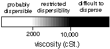
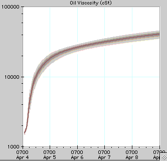

:orphan:

Chemical Dispersant Exercise
============================

    +--------------------------------------+--------------------------------------+
    | |image0|                             | .. rubric:: ADIOS 2 Exercises:       |
    |                                      |    Chemical Dispersant               |
    |                                      |    :name: adios-2-exercises-chemical |
    |                                      | -dispersant                          |
    +--------------------------------------+--------------------------------------+

    .. rubric:: Incident
       :name: incident

    At 0700 on April 4th, 2000, a collision occurred between a shrimp
    boat and a freighter about 30 miles southeast of Galveston, Texas at
    28° 55.9'N, 94° 21.5'W. Initial reports indicate 315 bbls of IFO 180
    were lost. The National Weather Service marine forecast indicates
    that the winds will be from the southwest at 10-20 knots for the
    next 36 hours.

    Approval has been given for the application of dispersants. Corexit
    9500 has been loaded onto a DC-4, and the aircraft is on standby in
    Houma, Louisiana. Unfortunately, the aircraft has a mechinical
    problem with the dispersant equipment. The contractor indicates that
    they will be able to disperse the next day. *Commander Jones would
    like to know if the oil will emulsify to the extent that dispersants
    will not work.*

    .. rubric:: ADIOS2 Model Input
       :name: adios2-model-input

    Oil: IFO 180

    #. Click Oil
    #. Select IFO 180 from the list of oils
    #. Click Select

    Winds: variable 10-20 knots

    #. Click Wind/Wave
    #. Select Constant Wind (default)
    #. Select April 4th at 0700 hours
    #. Enter Speed as 15 and choose knots from the popup menu.
    #. Enter SW for southwest or 225 as the Direction
    #. Click Uncertainty
    #. Enter Wind Speed Uncertainty as 5, and choose knots from the
       popup menu.
    #. Click OK
    #. Click OK

    Water: temperature ?°F

    #. Click Water
    #. Click on the question mark in the lower left side of the dialog
       box.
    #. Click on Read more about it in the on-line manual.
    #. Scroll down until you see Water Temperature Data Examples.
    #. Once you have found the water temperature, return to ADIOS.
    #. Enter the Temperature from the example and choose F from the
       popup menu. This should be 23°C.
    #. Select 32 (avg. oceanic) from the Salinity popup menu
    #. Select 5 (ocean) from the Water Sediment Load popup menu
    #. Click OK

    Release: 315 bbls

    #. Click Release
    #. Select Instantaneous Release
    #. Select the Time of Release as April 4th at 0700 hours
    #. Enter 315 as Amount Spilled and choose bbl from the popup menu
    #. Click OK

    .. rubric:: Discussion
       :name: discussion

    *Commander Jones would like to know if the oil will emulsify to the
    extent that dispersants will not work.*

    IFO-180's do not normally emulsify, however, the oil may weather and
    become very viscous so that dispersant may be less effective. You
    can address this issue by using the Oil Viscosity Graph. *Click
    Viscosity (located at the top of the window).* Notice that after 12
    hours, dispersability is restricted. The effectiveness of
    dispersants will be questionable. Ask your SSC for further guidence.

    |image1|

    Dispersibility versus viscosity.

    |image2| 

     

    --------------

    `|image3|\ Top <#ADIOS>`__ `|image4|\ Back <Exercise.html>`__
    `Home <Contents.html>`__

    ::

        Last updated June 6, 2000
        Send comments to adiosmail@hazmat.noaa.gov

     

.. |image0| image:: images/dispersant_pict.gif
   :width: 149px
   :height: 104px

