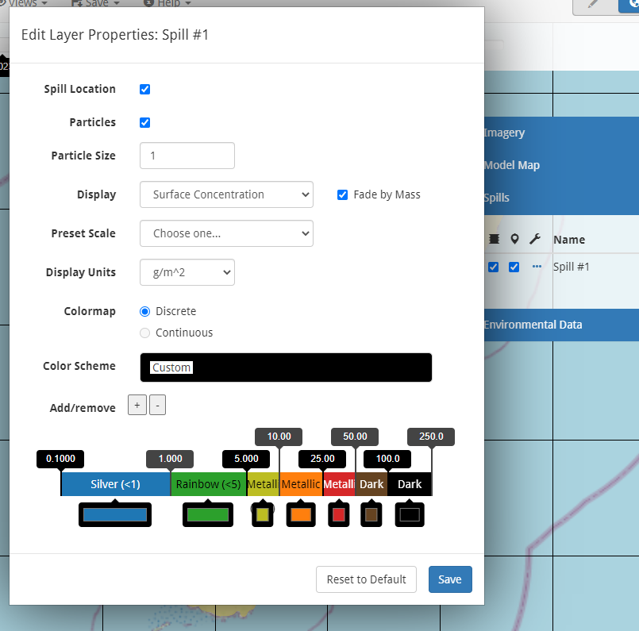

############################
Customizing Map View Display
############################

Coloring model particles based on properties
--------------------------------------------
To access the customization options for styling model particles, under the Spills section of the Layers panel click the Configure icon (:fa:`ellipsis`) next to the spill.

This brings up the Layer properties form for customing the spill "layer". By default the displayed spill propery is set to Mass and all the particles are colored uniformly (black dots). 

Clicking on the colorbar allows for selecting various color options - either uniform or varying based on a property. Use the Display pull down menu to select a property (mass, viscosity, surface concentration, or age). For more details, click the help icon (:fa:`circle-question`) at the top of the form.

