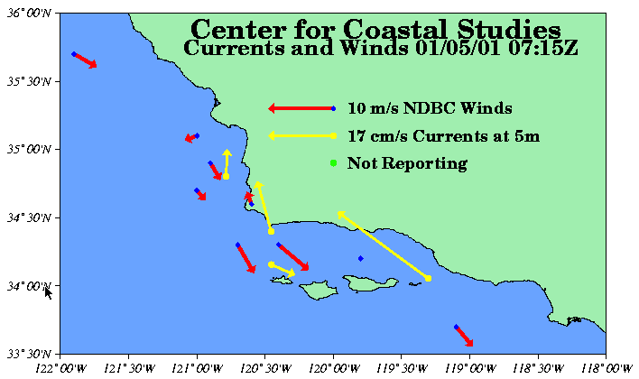
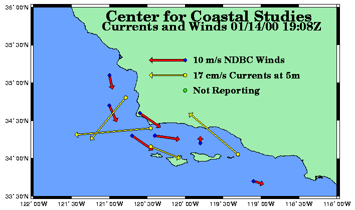
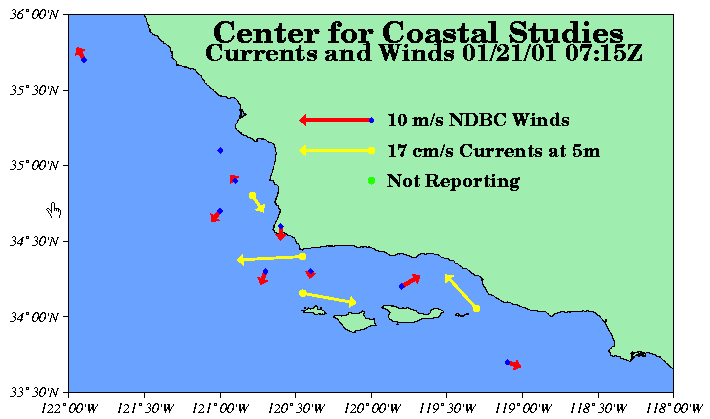
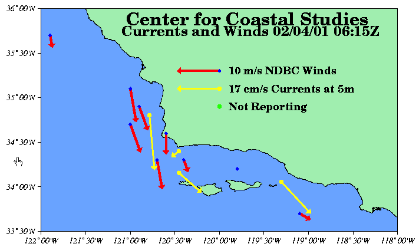
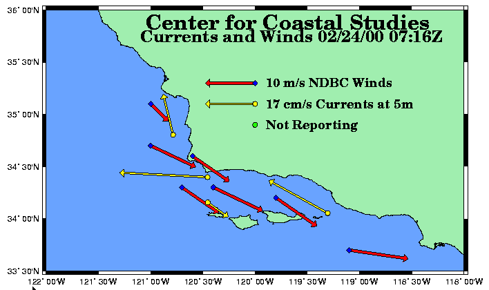

:orphan:

.. _sbc_examples:

Santa Barbara Channel Example Problems
======================================

Try out these examples to learn the basics of modeling oil spills in
Santa Barbara Channel. Explore how the changing circulation modes alter
an oil spill's trajectory, how wind can move an oil spill in a direction
different from the currents, and how model and observation limitations
can be overcome by considering both the "Best Guess" and the "Minimum
Regret" (Uncertainty) solutions. This knowledge will help you in
designing your own GNOME model runs.

**The following conditions hold for each of the examples:**

Model Start Time: User's choice.

Run duration: 24 hours, unless otherwise specified in a particular
example.

Uncertainty: Not included.

Wind: Constant at 0 knot, unless specified.

Pollutant type: Non-weathering.

Spill size: 1000 barrels.

Use GNOME's Standard Mode and the Santa Barbara Channel Location File to
answer the following questions:

Example 1.
----------

Make two linear spills extending across the Santa Barbara Channel
(SBC) and Santa Maria Basin (SMB). Make one in the east/west direction,
along 34° 52.06'N, and one in the north/south direction, along 119°
48.17'N.

How does your choice of current pattern affect the spill trajectories in
the first 24 hours?

    **Hints:** To easily set a line spill, click and drag the spill tool
    from the *any* starting point on the water area of the map to the
    *any* endpoint. In the Spill Information window that opens, you can
    then enter the exact latitude and longitude of the starting point
    and endpoint. (This method is much easier than moving your mouse
    around the map and watching its location in the lower left corner of
    the window!)

    To change the current pattern, but keep all other Location File
    settings the same, double-click the name of your Location File,
    "Santa Barbara Channel," in the left section of the Map Window (the
    Summary List). The Location File Welcome window will appear with all
    the settings you had previously chosen. You only have to enter
    information that you are changing. You can then rerun the model with
    the same spills, under the same conditions, but with a new current
    pattern.

    **Answer:** These three circulation patterns show the range of
    variability within the SBC and SMB. The SBC shows a general cyclonic
    (counterclockwise) circulation, but the direction of flow through
    the eastern entrance can reverse. The SMB shows either an
    anticyclonic (clockwise) circulation or a general northward trend.

Example 2.
----------

To investigate the effects of wind on oil spill movement, choose
the Relaxation pattern and set a spill at 34° 25.54'N, 120° 05.01'W.
Gradually increase the wind from the south (by 10 knots each time) and
examine where the oil impacts the beach.

**How does changing the wind speed change the distance the spill travels
before beaching?**

    **Hints:** To remove the line source spills from Example 1, select
    each spill's description ("Non-Weathering: 1000 barrels") under
    **Spills** in the Summary List. Under the GNOME **Item** menu,
    select Delete.

    To quickly set a spill at a particular location, simply double-click
    the Spill Tool on the GNOME toolbar. You can then enter the *exact*
    latitude and longitude of the spill in the Spill Information window.

    To increase the wind in your model, double-click **Wind** in the
    Summary List, and then enter the wind speed and direction in the
    Constant or Variable Wind window.

    **Answer:** With no wind, the spill follows the coast, but does not
    heavily impact the coastline. As the wind is increased, the impacts
    occur sooner after the spill occurs and closer to the spill site.

Example 3.
----------

Below are some pictures of Santa Barbara Channel winds and
currents (courtesy of the Center for Coastal Studies at the University
of California at San Diego, and the Dept. of the Interior Minerals
Management Service). **Use the pictures of the three current patterns in
the Santa Barbara Channel Location File and the information in the
"Selecting a Circulation Pattern" Help topic in the Location File to
help you identify the current pattern in each picture.** You don't have
to do all six examples in order to get an idea of how to do this task.
As in real spill conditions, you may not have enough information to make
an exact match, or the real conditions may vary from the classic
definitions. In particular, the winds can change quickly, while the
circulation and currents adjust to changes much more slowly.

    **Hint:** The arrows on the pictures point in the direction that the
    wind or current is flowing. **The longer the arrow, the faster the
    flow.** To determine upwelling or downwelling conditions, orient the
    paper so that you are looking down the wind arrow from tail to
    point. The water flow due to Ekman transport (caused by the wind and
    the earth's rotation) will be to your (and the arrow's) right. Water
    moving toward the coast will cause downwelling; water moving away
    from the coast will cause upwelling.

**a. January 5, 2001**

|pict 1|

**b. January 14, 2000**

|pict 2|

**c. January 21, 2001**

|picture3|

**d. January 22, 2000**

|picture4|

**e. February 4, 2001**

|picture5|

**f. February 24, 2000**

|pict 6|

    **Answer:**

    **a. January 5, 2001 - RELAXATION STATE**

    **b. January 14, 2000 - CONVERGENT STATE**

    **c. January 21, 2001 - CONVERGENT STATE**

**d. January 22, 2000 - UPWELLING STATE**

    **e. February 4, 2001 - UPWELLING STATE**

    **f. February 24, 2000 - RELAXATION STATE**

