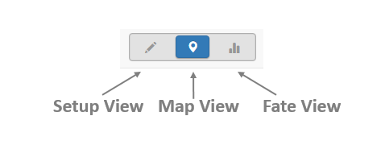
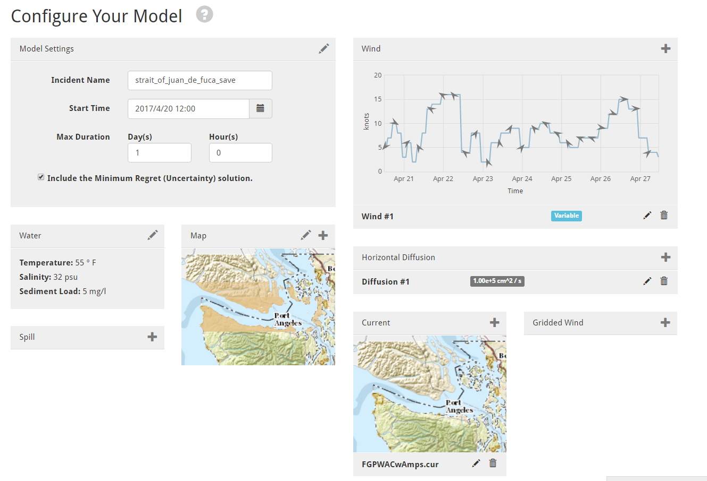
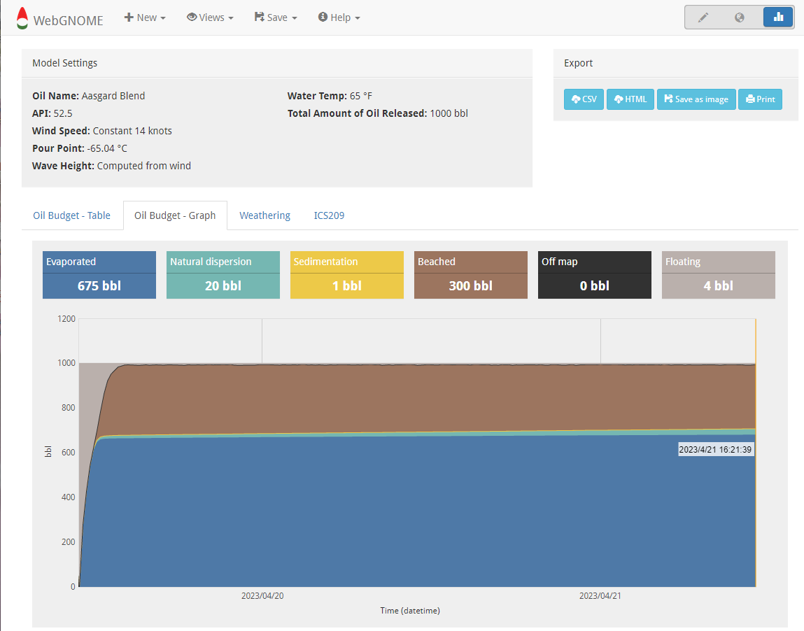

############
Model Views
############

The WebGNOME application has various "Views" for setting up the spill scenario and displaying the results of the simulation.
To switch between Views in the model, the icons
pictured below are always found on the top right of the Menu Bar. Alternatively, a selection can be made from the Views pull down option on the Menu Bar.

Setup View
----------

Setup view is used to interact with the model components, e.g. the map, the "movers" (physical
forces like winds and currents which move the spill), and the "weatherers" (processes that 
change the mass or other physical/chemical properties of the spill). 

Within Setup View a number of panels are used to interact with these various components. 
These panels can be used to change basic model parameters (e.g. the model start time 
or run duration within the "Model Settings" panel) or to load or create movers (e.g. 
the "Point Wind" and "Current" panels). If a :doc:`Wizard<wizards>` is used to get started, 
these panels may be auto populated. Users can then use this View to make edits to the 
model parameters. 

**Note that if the model was initially set up using the Fate Wizard, clicking 
Setup View will return the user to that more simplified interface.**

The inidvidual panels in Setup View have icons that can be clicked to create components (plus icon), edit components (pencil icon), and delete components (trashcan icon). In some panels, multiple components can be added. For example, there may be more than one data source for winds or currents available. Once created, components will show up in a list at the bottom of the panel. The Edit icon can then be used to modify parameters unique to that component (e.g. in the case of a wind or current, parameters include being able to extrapolate the data). The checkbox next to the component name is used to turn the component on/off in the model run. The clock icon shows whether
the component's time range is valid (green), semi-valid (yellow), or invalid (red) when compared to the model's time range.

Timeline Graphic 
================

The timeline at the bottom of the Setup View page is provided to help make sure movers and 
spills are in sync with the model run time. For example, when loading in data for currents 
or winds, this visual shows the start and end time for the data with respect to the model 
start and end times. It can be very useful for diagnosing model run time errors related to 
time mismatches.

Map View
--------

Map view is used to display the particles on a map. It has controls for controlling the animation playback and several pop-up panels available on the right hand side of the map (Layers, Legend, and Tools).

.. image:: map_view.png
|

Layers Panel 
============

The Layers Panel is accessible from the right side of the map. This panel can be used to select map displays, customize the display settings for the particles (e.g., color the particles based on concentration), and display environmental information like surface currents.

The Panel contains four sections: 

- Imagery
- Model Map
- Spills
- Environmental Data

For more on the layers panel see: :doc:`Customizing Map View Display<layers>`

Fate View
---------

This view displays the oil budget -- i.e., the amount of oil remaining on the surface versus the fraction evaporated and dispersed. Multiple panels can be selected to show the various weathering graphs.  

Model View
----------

This is a useful view for debugging a model set up or gaining understanding on the model set up in PyGNOME. It provides a graphical representation of the underlying model and is likely useful to more advanced users.

